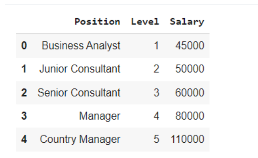
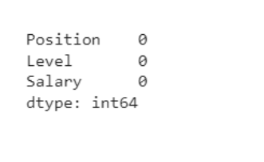
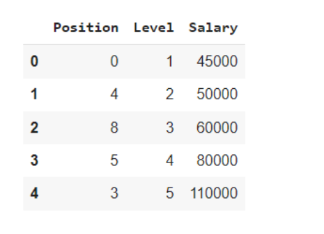
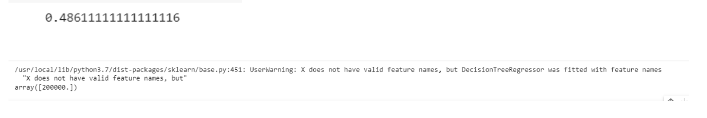

# Implementation-of-Decision-Tree-Regressor-Model-for-Predicting-the-Salary-of-the-Employee

## AIM:
To write a program to implement the Decision Tree Regressor Model for Predicting the Salary of the Employee.

## Equipments Required:
1. Hardware – PCs
2. Anaconda – Python 3.7 Installation / Moodle-Code Runner

## Algorithm
 ### Step1:Import pandas as pd and import the required dataset.

### Step2:Calculate the null values in the dataset.

### Step3:Import the LabelEncoder from sklearn.preprocessing

### Step4:Convert the string values to numeric values.

### Step5:Import train_test_split from sklearn.model_selection.

### Step6:Assign the train and test dataset.

### Step7:Import DecisionTreeRegressor from sklearn.tree.

### Step8:Import metrics from sklearn.metrics.

### Step9:Calculate the MeanSquareError.

### Step10:Apply the metrics to the dataset.

### Step11:Predict the output for the required values.

## Program:
```
/*
Program to implement the Decision Tree Regressor Model for Predicting the Salary of the Employee.
Developed by: Ch.Nagajyothi
RegisterNumber: 212221230015 
*/

import pandas as pd
data=pd.read_csv("Salary.csv")
data.head()
data.info()

data.isnull().sum()

from sklearn.preprocessing import LabelEncoder
le = LabelEncoder()
data["Position"]=le.fit_transform(data["Position"])
data.head()

x= data[["Position","Level"]]
y=data["Salary"]

from sklearn.model_selection import train_test_split
x_train,x_test,y_train,y_test = train_test_split(x,y,test_size = 0.2,random_state = 2)

from sklearn.tree import DecisionTreeRegressor
dt = DecisionTreeRegressor()
dt.fit(x_train,y_train)
y_pred = dt.predict(x_test)

from sklearn import metrics
mse = metrics.mean_squared_error(y_test,y_pred)
mse

r2= metrics.r2_score(y_test,y_pred)
r2

dt.predict([[5,6]])

```
## Output:










## Result:
Thus the program to implement the Decision Tree Regressor Model for Predicting the Salary of the Employee is written and verified using python programming.
